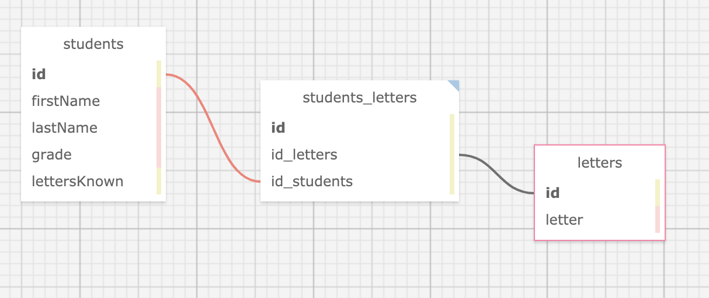
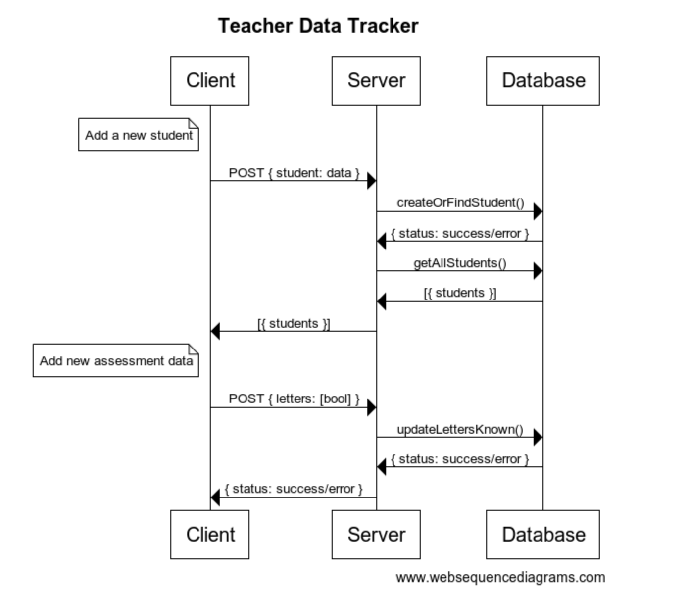

# Teacher Data Tracker: Letter Identification

## Resources
[React Docs](https://reactjs.org/docs/getting-started.html)
[Express Docs](http://expressjs.com/)
[Mongoose Docs](https://mongoosejs.com/)

### Backlog/Wish List
- [ ] Add ability for multiple assessments. Each assessment should pick up where the last one left off
- [ ] Add ability for different versions of this assessment (i.e. uppercase or sounds)
- [ ] As grades expand, add ability to get all with certain criteria (i.e. grade or teacher)
***

### Database Tables

***
### Web Sequence Diagram
